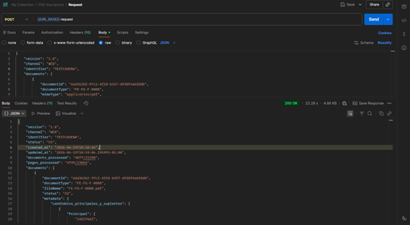
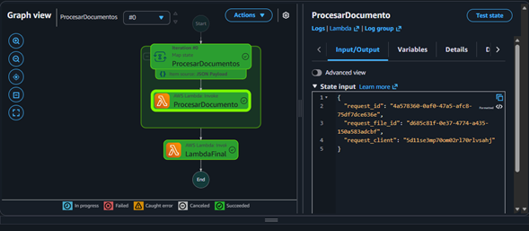
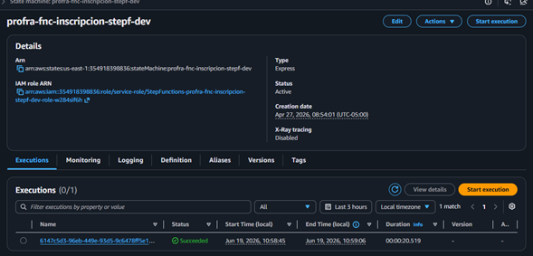
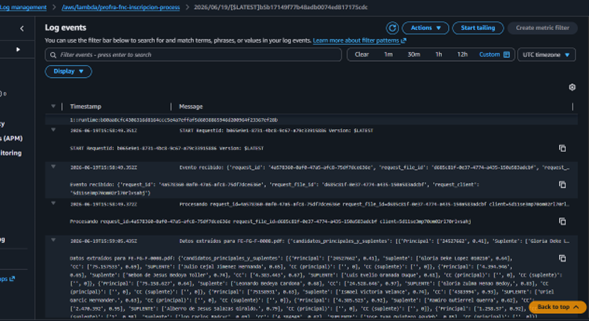

# Documentación de Capstone
## Sistema de Extracción de Información con IA sobre AWS

---

## 1. Descripción del Proyecto

### Objetivo

Proveer una HTTP API sincrónica que recibe peticiones con documentos
codificados en Base64, los procesa mediante servicios de Inteligencia
Artificial de AWS (Amazon Textract / OpenAI) para extraer información
estructurada, y retorna la respuesta al cliente en la misma petición HTTP.

### Caso de uso

El cliente envía un documento (imagen o PDF en Base64) a través de HTTPS.
El sistema decodifica el archivo, lo almacena en S3, extrae la información
usando Textract u OpenAI, procesa los resultados y retorna los datos
estructurados de forma sincrónica en la misma respuesta.

---

## 2. Arquitectura de la Solución

### 2.1 Componentes y justificación técnica

| Componente | Rol | Justificación |
|---|---|---|
| **API Gateway (HTTP API)** | Punto de entrada HTTPS | HTTP API tiene una latencia de invocación significativamente menor (~6ms vs ~10ms en REST API) porque su arquitectura interna es más liviana — no procesa el payload a través del motor de transformación de REST API. Para un flujo sincrónico donde el cliente espera la respuesta bloqueado, cada milisegundo importa en la experiencia del usuario. |
| **Lambda Auth** | Autenticación JWT (M2M) | La autenticación implementada sigue el flujo **OAuth 2.0 Client Credentials Grant**, diseñado para comunicación machine-to-machine (M2M). El sistema cliente obtiene un `access_token` JWT directamente desde el endpoint de Cognito usando `client_id` y `client_secret` del App Client. Este token es validado por el JWT Authorizer nativo de HTTP API Gateway contra el issuer de Cognito. |
| **Amazon Cognito** | Gestión de identidad | La solución seleccionada permite centralizar la autenticación y autorización, reduciendo la carga de implementación de seguridad en el código de la aplicación. Mejora la escalabilidad y reduce la superficie de ataque al delegar la gestión de identidad a un servicio administrado. Como contrapartida, introduce dependencia del proveedor cloud y cierta rigidez en personalizaciones avanzadas del flujo de autenticación. |
| **Amazon ECS Fargate** | Orquestador del flujo | Procesa el Base64, sube a S3, inicia el Step Function, espera resultado y retorna respuesta. Sin gestión de servidores. |
| **RDS Proxy + RDS MySQL** | Persistencia de peticiones | RDS Proxy gestiona el connection pooling, esencial para el manejo múltiple de consultas y paralelismo que brinda ECS y Step Functions. RDS MySQL garantiza la trazabilidad del sistema y la relación de cada uno de los flujos en paralelo. |
| **AWS Step Functions (Express)** | Orquestación de IA | Permite definir el sistema como una máquina de estados, donde cada etapa del proceso es representada como un estado independiente. Dentro del flujo se utiliza un estado `Map` para ejecutar procesamiento en paralelo sobre los múltiples documentos enviados en la solicitud, invocando funciones Lambda que interactúan con OpenAI o Textract. La orquestación controla el orden de ejecución y maneja errores y reintentos de manera nativa. |
| **Lambda OCR (Textract / OpenAI)** | Extracción de información | Invocación directa a servicios IA de AWS y OpenAI. Retorna resultado estructurado en JSON. |
| **Lambda PostProcesamiento** | Transformación | Normaliza y estructura la respuesta antes de retornarla al ECS. |
| **Amazon S3** | Almacenamiento de documentos | Alta durabilidad, escalabilidad automática y facilidad de integración con servicios como Lambda y Step Functions. |


---

## 3. Decisiones de Arquitectura (ADR)

### ADR-1: Selección de arquitectura del sistema

**Contexto**

El sistema requiere una arquitectura capaz de procesar solicitudes de forma
escalable, desacoplada y con capacidad de ejecutar tareas de procesamiento
intensivo utilizando servicios de inteligencia artificial. Además, se
necesita orquestación de procesos síncronos y almacenamiento de archivos
intermedios.

**Decisión**

Se eligió una arquitectura basada en servicios serverless en la nube
utilizando API Gateway como punto de entrada, funciones Lambda para la
lógica de negocio, Step Functions para la orquestación del flujo de
procesamiento y S3 para almacenamiento de archivos. Dentro del flujo, se
utiliza un estado `Map` en Step Functions para procesar múltiples elementos
en paralelo, incluyendo llamadas a servicios de inteligencia artificial
como OpenAI o AWS Textract.

Esta arquitectura fue seleccionada frente a alternativas basadas en
servidores monolíticos o microservicios desplegados en infraestructura
tradicional, debido a su capacidad de escalado automático, menor gestión
de infraestructura y mejor desacoplamiento de componentes.

**Consecuencias**

- ✅ Alta escalabilidad, resiliencia y separación de responsabilidades.
- ✅ Facilita el mantenimiento mediante modificación independiente de
  funciones Lambda o flujos en Step Functions.
- ⚠️ Introduce mayor complejidad en la orquestación y dependencia del
  ecosistema de servicios cloud.

---

### ADR-2: Selección del lenguaje de programación

**Contexto**

El sistema requiere un lenguaje de programación para la implementación de
la lógica de negocio en funciones serverless, especialmente para el
procesamiento de archivos, orquestación de llamadas a servicios externos
de inteligencia artificial y manipulación de datos.

**Decisión**

Se seleccionó **Python** como lenguaje principal para el desarrollo de las
funciones Lambda. Esta decisión se tomó considerando su amplia
compatibilidad con servicios cloud, su simplicidad sintáctica, su alto
rendimiento en tareas de procesamiento de datos y su extenso ecosistema de
librerías para integración con APIs y servicios de IA como OpenAI y
Textract.

Se evaluaron alternativas como .NET y Java, pero se priorizó Python debido
a su rapidez de desarrollo, menor complejidad en la implementación y fuerte
adopción en entornos de análisis de datos y machine learning.

**Consecuencias**

- ✅ Desarrollo más rápido y mantenible, con menor cantidad de código.
- ✅ Mejor integración con servicios de IA y procesamiento de datos.
- ⚠️ Menor rendimiento en escenarios altamente concurrentes vs lenguajes
  compilados, mitigado por el modelo serverless utilizado.

---

### ADR-3: Selección del modelo de comunicación del sistema

**Contexto**

El sistema requiere definir cómo se entregan los resultados del
procesamiento al usuario final, considerando que el flujo incluye múltiples
etapas con AWS Step Functions y llamadas a servicios externos de IA.

**Decisión**

Se optó por un **modelo de comunicación síncrono**, donde el cliente espera
la respuesta final una vez que el flujo completo de procesamiento ha
terminado. Esto implica que API Gateway mantiene la conexión activa hasta
que Step Functions finaliza la ejecución.

Se evaluaron alternativas como procesamiento asíncrono mediante colas (SQS)
o eventos (EventBridge), pero fueron descartadas para simplificar la
interacción del cliente y entregar una respuesta inmediata al finalizar el
procesamiento.

**Consecuencias**

- ✅ Simplifica la experiencia del consumidor: no requiere consultas
  adicionales para obtener resultados.
- ⚠️ Puede incrementar la latencia percibida y limitar la escalabilidad en
  escenarios de alta carga, al mantener la conexión abierta hasta la
  finalización del flujo.

## 4. Estructura del Servicio ECS (profra-fnc-inscripcion-request)

El contenedor desplegado en Amazon ECS Fargate está construido sobre
**Python 3.11** usando una imagen base `python:3.11-slim` para minimizar
el tamaño de la imagen y reducir la superficie de ataque.

### 4.1 Estructura de archivos

```text
profra-fnc-inscripcion-request/
├── docker/                         # Recursos adicionales de configuración Docker
├── lambda_modules/                 # Módulos de lógica de negocio y servicios
│   ├── db_service.py               # Capa de acceso a datos (RDS vía RDS Proxy)
│   ├── exceptions.py               # Excepciones personalizadas del dominio
│   ├── s3_service.py               # Operaciones con Amazon S3 (upload de documentos)
│   ├── stepfunctions_service.py    # Invocación y espera del Step Functions Express
│   └── utils.py                    # Utilidades compartidas (decodificación Base64, etc.)
├── .dockerignore                   # Exclusiones del contexto de build Docker
├── .env                            # Variables de entorno locales (no commiteado)
├── .gitignore                      # Exclusiones del repositorio
├── Dockerfile                      # Definición de la imagen del contenedor
├── lambda_function.py              # Handler principal — punto de entrada del servicio
├── main.py                         # Inicialización de la aplicación (servidor HTTP)
└── requirements.txt                # Dependencias Python del proyecto
```

### 4.2 Responsabilidad de cada módulo

| Archivo | Responsabilidad |
|---|---|
| `main.py` | Inicializa el servidor HTTP dentro del contenedor y registra las rutas disponibles |
| `lambda_function.py` | Handler principal que orquesta el flujo: recibe la petición, delega a los módulos y retorna la respuesta |
| `lambda_modules/s3_service.py` | Decodifica los documentos Base64 recibidos y los sube a Amazon S3 |
| `lambda_modules/stepfunctions_service.py` | Inicia la ejecución del Step Functions Express y espera el resultado de forma sincrónica |
| `lambda_modules/db_service.py` | Registra y consulta el estado de las peticiones en RDS MySQL a través de RDS Proxy |
| `lambda_modules/exceptions.py` | Define excepciones de dominio para manejo estructurado de errores en el flujo |
| `lambda_modules/utils.py` | Funciones auxiliares reutilizables (parsing, validaciones, formateo de respuestas) |
| `requirements.txt` | Declara las dependencias: `boto3`, cliente HTTP, librerías de utilidad |

## 5. Estructura de la Lambda OCR (profra-fnc-inscripcion-ocr)

Esta función Lambda se despliega mediante un paquete **`.zip`** directamente
en AWS Lambda — sin contenedor Docker — dado que las dependencias son
livianas y el tamaño del paquete se mantiene dentro del límite de 50 MB
permitido por Lambda.

### 5.1 Estructura de archivos

```text
profra-fnc-inscripcion-ocr/
├── lambda_modules/                       # Módulos de lógica de negocio y servicios
│   ├── ai_processor.py                   # Lógica de procesamiento con OpenAI
│   ├── db_service.py                     # Capa de acceso a datos (RDS vía RDS Proxy)
│   ├── exceptions.py                     # Excepciones personalizadas del dominio
│   ├── format_5_textract_processor.py    # Procesador de resultados Textract formato 5
│   ├── format_6_textract_processor.py    # Procesador de resultados Textract formato 6
│   ├── format_8_textract_processor.py    # Procesador de resultados Textract formato 8
│   ├── format_45_textract_processor.py   # Procesador de resultados Textract formato 45
│   ├── s3_service.py                     # Descarga del documento desde Amazon S3
│   ├── textract_processor_handler.py     # Orquestador de llamadas a Amazon Textract
│   └── utils.py                          # Utilidades compartidas
├── package/                              # Dependencias empaquetadas para el .zip
├── .env                                  # Variables de entorno locales (no commiteado)
├── .gitignore
├── handle.py                             # Lógica de manejo y enrutamiento de la extracción
├── lambda_function.py                    # Handler principal — entry point de la Lambda
└── requirements.txt                      # Dependencias Python del proyecto
```

### 5.2 Responsabilidad de cada módulo

| Archivo | Responsabilidad |
|---|---|
| `lambda_function.py` | Entry point invocado por Step Functions. Recibe el evento, delega al handler y retorna el resultado estructurado en JSON |
| `handle.py` | Enruta la extracción según el tipo de documento y decide si usar Textract o OpenAI |
| `lambda_modules/ai_processor.py` | Integración con OpenAI para extracción de información en documentos donde Textract no es suficiente |
| `lambda_modules/textract_processor_handler.py` | Orquesta las llamadas a Amazon Textract y normaliza el resultado |
| `lambda_modules/format_*_textract_processor.py` | Procesadores específicos por formato de documento — cada uno interpreta la estructura de bloques de Textract según el tipo de documento (5, 6, 8, 45) |
| `lambda_modules/s3_service.py` | Descarga el documento desde S3 para pasarlo a Textract o al modelo de IA |
| `lambda_modules/db_service.py` | Actualiza el estado del procesamiento en RDS |
| `lambda_modules/exceptions.py` | Excepciones de dominio para manejo estructurado de errores |
| `lambda_modules/utils.py` | Funciones auxiliares compartidas entre módulos |

## 6. Estructura de la Lambda PostProcesamiento (profra-fnc-inscripcion-response)

Esta función Lambda se despliega mediante un paquete **`.zip`** directamente
en AWS Lambda. Su responsabilidad es normalizar y estructurar el resultado
retornado por la Lambda OCR antes de devolverlo al ECS y finalmente al cliente.

### 6.1 Estructura de archivos

```text
profra-fnc-inscripcion-response/
├── lambda_modules/                 # Módulos de lógica de negocio y servicios
│   ├── db_service.py               # Capa de acceso a datos (RDS vía RDS Proxy)
│   ├── exceptions.py               # Excepciones personalizadas del dominio
│   └── utils.py                    # Utilidades compartidas
├── .env                            # Variables de entorno locales (no commiteado)
├── lambda_function.py              # Handler principal — entry point de la Lambda
├── requirements.txt                # Dependencias Python del proyecto
```

### 6.2 Responsabilidad de cada módulo

| Archivo | Responsabilidad |
|---|---|
| `lambda_function.py` | Entry point invocado por Step Functions. Recibe el resultado de la Lambda OCR, delega la transformación y retorna la respuesta final estructurada en JSON |
| `lambda_modules/db_service.py` | Actualiza el estado final de la petición en RDS MySQL, registrando el resultado del procesamiento |
| `lambda_modules/exceptions.py` | Excepciones de dominio para manejo estructurado de errores en la transformación |
| `lambda_modules/utils.py` | Funciones auxiliares para normalización, limpieza y formateo de la respuesta final |


## 7. Contrato de la API

### 7.1 Endpoint de autenticación (M2M)

Antes de consumir la API, el sistema cliente debe obtener un `access_token`
mediante el flujo OAuth 2.0 Client Credentials Grant de Cognito:

```http
POST https://<dominio>/auth
Content-Type: application/x-www-form-urlencoded

grant_type=client_credentials
&client_id=<CLIENT_ID>
&client_secret=<CLIENT_SECRET>
```

**Respuesta:**
```json
{
  "access_token": "eyJraWQiOiJ...",
  "token_type": "Bearer",
  "expires_in": 3600
}
```

---

### 7.2 Endpoint de procesamiento

```http
POST https://<dominio>/request
Authorization: Bearer <access_token>
Content-Type: application/json
```

### 7.3 Request Body

| Campo | Tipo | Requerido | Descripción |
|---|---|---|---|
| `version` | `string` | ✅ | Versión del contrato de la API |
| `channel` | `string` | ✅ | Canal de origen de la solicitud (ej. `WEB`) |
| `identifier` | `string` | ✅ | Identificador de la cadena o cliente |
| `documents` | `array` | ✅ | Lista de documentos a procesar |
| `documents[].documentId` | `string (UUID)` | ✅ | Identificador único del documento |
| `documents[].documentType` | `string` | ✅ | Tipo/formato del documento (ej. `FE-FG-F-0008`) |
| `documents[].mimeType` | `string` | ✅ | Tipo MIME del archivo (ej. `application/pdf`) |
| `documents[].documentBase64` | `string` | ✅ | Contenido del documento codificado en Base64 |

### 7.4 Ejemplo de Request

```json
{
  "version": "1.0",
  "channel": "WEB",
  "identifier": "CADENAPROD",
  "documents": [
    {
      "documentId": "66d362b2-97c2-4f10-b357-d93093abfdd8",
      "documentType": "FE-FG-F-0008",
      "mimeType": "application/pdf",
      "documentBase64": "JVBERi0xLjcKJYGBgYEKCjQgMCBvYmoKPDwKL1R5cGUgL1hP... [Base64 truncado]"
    }
  ]
}
```

> **Nota:** El campo `documentBase64` contiene el binario completo del archivo
> codificado en Base64. Para un PDF estándar de una página, el tamaño del
> string puede superar los **500 KB**. El límite de payload de HTTP API
> Gateway es de **10 MB**.

### 7.5 Response Body

**HTTP 200 OK**

| Campo | Tipo | Descripción |
|---|---|---|
| `version` | `string` | Versión del contrato de respuesta |
| `channel` | `string` | Canal de origen de la solicitud |
| `identifier` | `string (UUID)` | Identificador único de la solicitud procesada |
| `status` | `string` | Estado global de la solicitud (`CO` = Completado) |
| `created_at` | `string (ISO 8601)` | Fecha y hora de creación de la solicitud |
| `updated_at` | `string (ISO 8601)` | Fecha y hora de última actualización |
| `documents_processed` | `string` | Documentos procesados acumulados en el sistema (`procesados/total`) |
| `pages_processed` | `string` | Páginas procesadas acumuladas en el sistema (`procesadas/total`) |
| `documents` | `array` | Lista de documentos con sus resultados de extracción |
| `documents[].documentId` | `string (UUID)` | Identificador del documento |
| `documents[].documentType` | `string` | Tipo de formulario procesado |
| `documents[].fileName` | `string` | Nombre del archivo procesado |
| `documents[].status` | `string` | Estado del documento (`CO` = Completado) |
| `documents[].metadata` | `object` | Información extraída estructurada por secciones del formulario |
| `documents[].metadata.<seccion>[n].<campo>` | `[valor, confianza]` | Cada campo extraído retorna un array con el valor y su score de confianza (0.0 - 1.0) |
| `events` | `array` | Trazabilidad del ciclo de vida del procesamiento por documento |
| `events[].step` | `string` | Etapa del proceso (ej. `AUTO_INDEXATION`) |
| `events[].status` | `string` | Estado del evento (`RE`=Recibido, `ST`=Iniciado, `IX`=Indexado, `CO`=Completado) |
| `events[].message` | `string` | Código descriptivo del evento |
| `events[].detail` | `object` | Detalle del evento con mensaje explicativo |

---

### 7.6 Ejemplo de Response (resumido)

```json
{
  "version": "1.0.0",
  "channel": "WEB",
  "identifier": "1deecae0-d1f0-453e-8e9b-6a5038f211bf",
  "status": "CO",
  "created_at": "2026-06-07T10:37:44",
  "updated_at": "2026-06-07T10:38:05.646493-05:00",
  "documents_processed": "142/21298",
  "pages_processed": "156/23064",
  "documents": [
    {
      "documentId": "80ab118b-909e-4a92-a4dc-e7a5e383f4bc",
      "documentType": "FE-FG-F-0006",
      "fileName": "hdv_pagina_1.pdf",
      "status": "CO",
      "metadata": {
        "informacion_candidatura": [
          {
            "Número de cédula de ciudadanía": ["24.527.662", 0.98],
            "Departamento": ["Caldas", 0.61],
            "Comité municipal": ["Belalcazar", 0.54]
          }
        ],
        "informacion_candidato": [
          {
            "Nombre": ["Gloria Deice", 0.98],
            "Apellido": ["Lopez 01020", 0.94],
            "Celular": ["3137434556", 0.99],
            "Fecha de nacimiento (DD/MM/AAAA)": ["17/07/1967", 1.0],
            "Género": ["Femenino", 0.68],
            "Escolaridad": ["Media", 0.78]
          }
        ]
      },
      "created_at": "2026-06-07T10:37:44",
      "updated_at": "2026-06-07T10:37:54"
    }
  ],
  "events": [
    {
      "documentId": "80ab118b-909e-4a92-a4dc-e7a5e383f4bc",
      "created_at": "2026-06-07T10:37:48",
      "step": "AUTO_INDEXATION",
      "status": "ST",
      "message": "STARTED",
      "detail": { "message": "Procesamiento iniciado" }
    },
    {
      "documentId": "80ab118b-909e-4a92-a4dc-e7a5e383f4bc",
      "created_at": "2026-06-07T10:37:54",
      "step": "AUTO_INDEXATION",
      "status": "CO",
      "message": "INDEXATION_FINISHED",
      "detail": { "message": "Proceso de extracción de información finalizado con éxito." }
    }
  ]
}
```

> **Nota sobre scores de confianza:** Cada campo extraído retorna un array
> `[valor, confianza]` donde `confianza` es un float entre `0.0` y `1.0`.
> Un score de `1.0` indica máxima certeza en la extracción; valores
> inferiores a `0.7` indican baja confianza y pueden requerir revisión manual.


## Petición de ejemplo



## Visualización del inicio de flujo en Step Functions




## Logs de CloudWatch


# Documentación de Despliegue - MCDS Capstone

## Petición de ejemplo


## Visualización del inicio de flujo en Step Functions

El siguiente diagrama muestra el workflow definido y una ejecución de ejemplo.




## Logs de CloudWatch

Los logs de las funciones Lambda se pueden monitorear desde CloudWatch
para verificar la ejecución correcta del flujo.




## Arquitectura e infraestructura

El proyecto utiliza Terraform para provisionar todos los recursos en AWS.
La infraestructura incluye API Gateway, Step Functions y funciones Lambda
orquestadas para el flujo principal.

### Estructura del proyecto Terraform

- `apigateway.tf` — API Gateway REST y configuración de rutas
- `cognito.tf` — User Pool y autenticación
- `ecs.tf` — Cluster ECS / Fargate
- `lambda_auth.tf` — Lambda de autorización
- `lambda_ocr.tf` — Lambda de procesamiento OCR
- `lambda_postprocesamiento.tf` — Lambda de postprocesamiento
- `outputs.tf` — Valores de salida (ARNs, URLs, endpoints)
- `provider.tf` — Configuración del provider AWS
- `rds.tf` — Base de datos RDS
- `s3.tf` — Buckets S3
- `stepfunctions.tf` — Definición del workflow Step Functions
- `variables.tf` — Variables de entrada
- `vpc.tf` — Red VPC, subnets y security groups


### Pasos para desplegar

1. Inicializar Terraform:
```bash
terraform init
```

2. Ver los cambios antes de aplicar:
```bash
terraform plan
```

3. Aplicar la infraestructura:
```bash
terraform apply -auto-approve
```

4. Destruir la infraestructura (si es necesario):
```bash
terraform destroy
```
